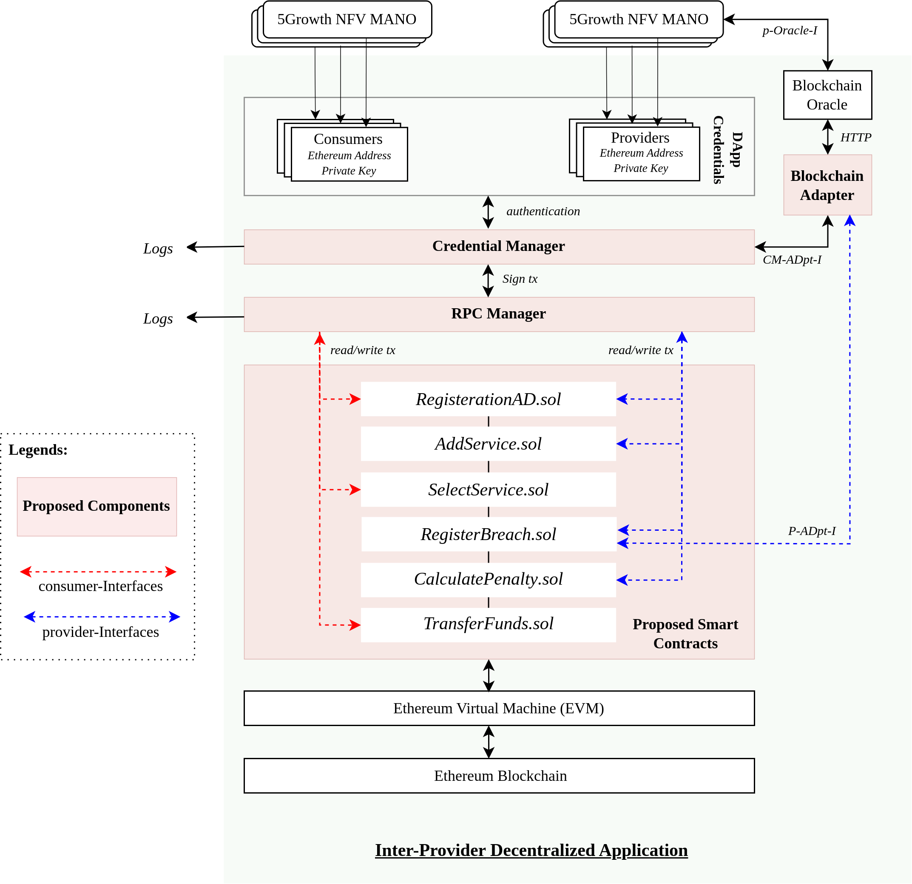

# Performance Analysis, Lessons Learned and Practical Advice for a 6G Inter-Provider DApp on the Ethereum Blockchain

## Abstract

This paper presents a multi-contract blockchain framework for inter-provider agreements in 6G networks, emphasizing performance analysis under a realistic Proof-of-Stake (PoS) setting on Ethereum’s Sepolia testnet. We begin by quantifying Ethereum Virtual Machine (EVM)-based gas usage for critical operations such as provider registration, service addition, and SLA penalty enforcement, observing that cold writes and deep data structures can each inflate gas consumption by up to 20\%. We then examine block-level dynamics when multiple transactions execute concurrently, revealing that moderate concurrency (e.g., 30–50 simultaneous transactions) can fill blocks to 80–90 of their gas limit and nearly double finalization times from around 15 seconds to over 30 seconds. Finally, we synthesize these insights into a practical design guide, demonstrating that flattening nested mappings, consolidating storage writes, and selectively timing high-impact transactions can markedly reduce costs and latency spikes. Collectively, our findings underscore the importance of EVM-specific optimizations and transaction scheduling for large-scale DApps in 6G telecom scenarios.




## Overview of Smart Contracts

- **RegistrationAD.sol**: Registers Administrative Domains (ADs) as either Providers or Consumers, establishing their role in the decentralized system.

- **AddService.sol**: Allows registered Providers to advertise their available services by recording service metadata (e.g., location, cost) on-chain.

- **SelectService.sol**: Enables Consumers to browse and select services offered by Providers, creating a binding service agreement.

- **RegisterBreach.sol**: Logs any breaches of service-level agreements (SLAs) by Providers based on performance data, typically fetched from off-chain sources.

- **CalculatePenalty.sol**: Automatically computes monetary penalties for Providers who violate SLAs, using a predefined breach-to-penalty formula.

- **TransferFunds.sol**: Handles the final settlement by transferring Ether from Consumers to Providers or vice versa, based on service agreements or penalties.


## Installation and Running Instructions Using Hardhat

### Prerequisites

- Node.js installed (version 14.x or later)
- A personal Ethereum wallet (e.g., MetaMask)

### Setup

1. **Clone the repository:**
   ```
   git clone <repository-url>
   cd <repository-directory>
   ```

2. **Install dependencies:**
   ```
   npm install
   ```

3. **Create a `.env` file:**
   Add your Ethereum wallet private key and Alchemy/Polygon node URL:
   ```
   PRIVATE_KEY="your-wallet-private-key"
   SEPOLIA_URL="https://eth-sepolia.g.alchemy.com/v2/your-api-key"

   ```

### Common Hardhat Commands

- **Compile contracts:**
  ```
  npx hardhat compile
  ```
  This compiles the smart contracts and checks for any syntax errors.

- **Run tests:**
  ```
  npx hardhat test
  ```
  Execute unit tests for the contracts to ensure correct behavior.

- **Deploy contracts:**
  ```
  npx hardhat run scripts/deploy.js --network sepolia
  ```
  Deploys the smart contracts to the Sepolia testnet.

- **Interact with deployed contracts:**
  ```
  npx hardhat console --network sepolia
  ```
  Deploys the smart contracts to the Ethereum Sepolia testnet.

- **Verify contract on Etherscan:**
  ```
  npx hardhat verify --network sepolia DEPLOYED_CONTRACT_ADDRESS
  ```
  Verifies the source code of your deployed contract on the Polygon Etherscan, which is useful for transparency and trust.

### Deployment via Hardhat Ignition

If you want to use Hardhat Ignition for deployment:
```
npx hardhat ignition deploy ./ignition/modules/file_name.js
```
This command deploys modules using Hardhat Ignition, a plugin for advanced deployment scripts.

## Conclusion

In this work, we designed, implemented, and empirically evaluated a multi-contract DApp for inter-provider agreements on the Ethereum Sepolia testnet, providing detailed insights into gas consumption, transaction latency, and block-level resource utilization under realistic network conditions. Our experimentation revealed that repeated cold writes introduce a 15–20 increase in gas usage—crucially affecting large onboarding phases when new domains register en masse. Likewise, we observed that deep or nested data structures can impose a 5–10 overhead in gas costs per access, magnified when multiple participants act concurrently. As batch sizes rose, finalization times grew from baseline levels near 13–15 seconds to over 30 seconds or more, especially when block usage approached 80–90 of its gas limit.

These findings affirm that gas and latency behavior hinge not just on per-function optimizations but also on concurrency management and network-level constraints. Even moderate concurrency waves can saturate blocks, defer some transactions to subsequent blocks, and inflate end-to-end settlement times. Consequently, our lessons learned emphasize (i) avoiding excessive cold writes by consolidating or batching initial state updates, (ii) flattening nested data layouts to reduce repeated lookups, and (iii) scheduling or throttling large transaction bursts so they do not overlap and worsen block congestion. Introducing dynamic fee adjustments for critical operations can further mitigate latencies under load.

Overall, this study demonstrates how a careful interplay of smart-contract design, data-structure choices, and transaction timing can meaningfully improve performance in a multi-administrative 6G environment. By adopting the recommended practices—such as caching, zero-based enumerations, and off-peak scheduling—smart contract development can reduce gas overhead and latency, thereby enhancing the viability of on-chain resource sharing, SLA enforcement, and cross-domain coordination in next-generation telecom systems.
